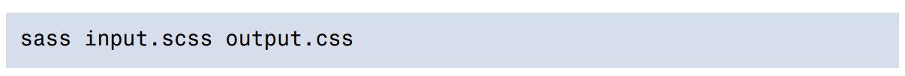

# **Getting Started**

***In the previous chapter, we talked a lot about what Sass actually is and how it can
help us bridge the gap between what CSS can offer and what we actually need in
our daily routine as web designers. Now is well past the time to start.
As discussed previously, Sass (mostly) exists as both a Ruby gem (sometimes called
Ruby Sass) and a wrapped C/C++ library (also known as LibSass). Additionally,
there are a lot of applications for front-end development that take care of everything
for you, such as CodeKit1 or Prepros2.
We’ll now see how to set it up in these environments, starting with the Ruby version.***

## **Ruby Sass**
**The programming language Ruby handles dependencies as gems. A `gem` is a package
that contains program (or script) information along with files to install. Therefore,
the sass gem is a package containing everything needed to compile Sass stylesheets
to CSS.To install the Sass gem, you will need Ruby first***
## **Installing Ruby**
***On Mac OS, Ruby comes preinstalled so there’s nothing further to do.
On Debian or Ubuntu Linux distributions, you need to install Ruby manually like
so:***

***For other less common Linux distributions, I recommend you check the Ruby official
documentation3 to see how to install it properly.
On a Windows machine, you’ll have to go through the Ruby Installer4 setup, a
simple program that helps install and run Ruby. It’s slightly less straightforward
than other operating systems, but what can you do?***

## **Installing Sass**
***Once Ruby is correctly set up, you can start installing gems, in particular the one
we care about: sass. To install it, open a terminal window (on Mac OS, it would
be the Terminal application, while on Windows, it would be Ruby prompt). Then
type the following command:***

***And that’s it! Sass is now installed on your machine and you can use the sass
command to compile your stylesheets. You have to admit it was very simple, wasn’t
it?***

## **Using Sass**

***Now that you’ve installed the Sass gem, let’s try to use it.
The Sass gem provides a sass command that accepts a lot of options. For the sake
of simplicity, we won’t be covering them all, although we’ll still address how to
use the basics. See the official documentation5 for more advanced usages.
In its simplest form, the sass command accepts an input file and an output file,
like so:***

***When working on stylesheets, it’s tedious to execute the former command every
time we make a change to the input file. To work around this, we can use what we
call a watcher. A watcher is a program that detects when a file is being changed,
executing a task when it happens.
Sass comes with a built-in watch feature: the --watch option. Every time the input
file is being modified, Sass will recompile it and override the output file:***

***As we’ll discuss in great length in Chapter 9, it is quite uncommon to have just one
single Sass file to compile. More often than not, styles are written across a plethora
of files gathered in a folder. You will want Sass to compile the whole folder without
having to specify a list of files manually. This is how you do it:***

## **LibSass (with node-sass)**
***As stated in the first chapter, LibSass is unusable on its own and must be wrapped
by another library to provide an interface for compiling Sass stylesheets to CSS.
The most popular wrapper for LibSass has to be node-sass6, a Node.js library that
compiles Sass to CSS through LibSass.***

## **Installing Node.js**

***To be able to use node-sass, we’ll obviously require Node.js. The easiest way to install
Node.js is by using one of the installers on the home page of the project7. Once
done, you’ll be able to install node packages, which leads us to the next step.***

## **Installing node-sass**

***Node-sass is a Node package distributed through npm8. It provides both a commandline interface and a JavaScript API to interact with the inner program. Your first
task is to install it—either locally in the project with --save or globally with -g:***
