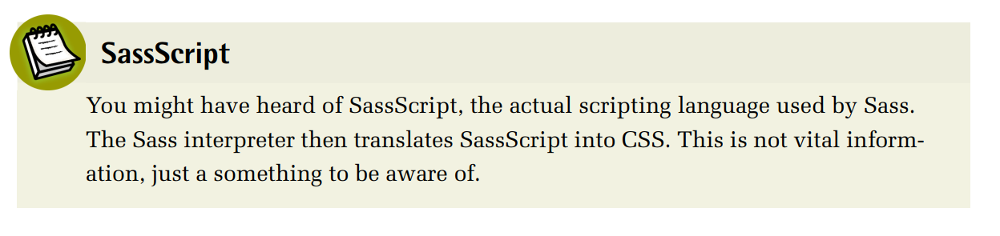

# **Hellow World**

## **CSS in Modern Front-end Development**
***The creation and maintenance of our projects on the Web has advanced as the Web
has progressed. Where we were once perhaps webmasters, the many, varied disciplines involved in making websites and applications has diversified. Front-end development is now one of many roles required in making today’s websites. A frontend developer will generally now produce HTML, CSS, and JavaScript for a web
application or site so that its visitors can access the content and interact with it.***

***With modern websites providing more content in various ways and with most web
makers adopting an approach that incorporates responsive web design principles,
we’re now writing more complex CSS than ever before. Add to that how CSS is an
ever-changing language, with more and more features added to its existing set every
year.***
***CSS practices and methodologies such as OOCSS1, SMACSS2, ITCSS3, and BEM4
(to name but four) are excellent tools and processes that help with writing stylesheets
and keeping us sane in this modern era of front-end development. Yet, creating CSS
for a responsive, device-agnostic website using OOCSS and BEM can lead to thousands of lines of code in one cumbersome file.***

***We will soon explore how Sass can help you with this. But if you happen to be a
total beginner on the matter, you might even be wondering …***


## **What is Sass?**
**Sass is a stylesheet language that is an extension of CSS. It is one of a few preprocessors (more on that in a bit) available to the front-end developer. As it has been
around the longest (of the aforementioned preprocessors), we could agree with the
official website5 when it reports to be the “most mature, stable, and powerful professional-grade CSS extension language in the world.”***

***Using Sass helps eliminate some of the monotony and overhead from writing CSS.
No longer will you have to remember that specific hex color code for the company’s
brand. Say goodbye to one long CSS stylesheet or additional HTTP requests, as well
as increased page load times by splitting up your CSS files to several files such as
reset.css, mobile.css, tablet.css, desktop.css and print.css. Want an easier way to write
CSS media queries? Sass has you covered. Like using ems or rems but hate working
out the math? Sass can help you.***

***All in all, we can safely state that Sass will make it easier for you to develop websites
and web applications—benefiting you, your client, and your clients’ users. Keep****
***your work in check and minimize opportunities for broken designs using the power
of Sass.***

***Sass may have its downfalls but, generally, problems that developers find with Sass
are usually when they struggle to understand some aspect of it. With this book, we
hope to give you the building blocks to write awesome Sass code. But you will require a firm grasp of CSS as well; if you write bad CSS in the first place, you’ll end
up writing bad Sass too. You might be familiar with the saying “Tools do not output
bad code. Bad developers do.” Remember, Sass is just a preprocessing tool, which
leads us to our next section.***


## **What is preprocessing?**
***As mentioned, Sass is a preprocessor. It takes Sass (.sass) or SCSS (.scss) files as
input, and outputs CSS files (.css). Sass adds a lot of great features that can help
to create better stylesheets, but as you know, web browsers only understand CSS,
not Sass. What we do is write our CSS (with as much a sprinkling of Sass as needed)
in .scss or .sass files in our code editor, and then have Sass compile that into a .css
file for the browser to read.***

***Using a preprocessing language such as Sass means we’re not bound within the
limitations of CSS. Sass can—and does—add features that enhance our writing of
CSS; however, it does not—and cannot—add features to CSS itself. It’s vital that
you grasp this from the outset.***
```sass

```


## **The Tale of Two Syntaxes**
***When talking about Sass, we usually refer to the preprocessor and the language as
a whole; for example, a Sass project, or a Sass variable. Meanwhile, Sass (the preprocessor) allows two syntaxes:***

1. **Sass, also known as the indented syntax**
2. **SCSS, or Sassy CSS, a CSS-like syntax**


***Let’s pause for a moment for a short history lesson. Initially, `Sass` was part of another
preprocessor (that still exists) called Haml6, which was heavily inspired by the
programming language `Ruby`. Sass stylesheets used a Ruby-like syntax with no
braces or semicolons, and a strict indentation:***


***This was up until 2009, when the new .scss file format was introduced that adhered
more closely to the usual CSS syntax. The rule of thumb here is if it is valid CSS,
it’s valid `SCSS`:***


***As to which syntax to use, the choice is really up to the author as both are strictly
equivalent in features. The Sass indented syntax is shorter and lighter to type because
almost all punctuation is gone, but it’s also incompatible with default CSS syntax.
It would appear that SCSS is the most popular in the Sass community as it is closer
to CSS and has an easier learning curve, contrary to the whitespace-sensitive syntax
4 Jump Start Sassof Sass. Because of this, we’ll be using SCSS in the code displayed throughout this
book.
Note that “Sass” is never uppercase, no matter whether we’re talking about the
language or the syntax. Meanwhile, “SCSS” is always uppercase. You could use
http://SassnotSASS.com/ as a reminder.***


```sass

```


## **LibSass**
***There are two primary implementations of the Sass compiler: one in Ruby, and
another (called LibSass) in C/C++. People often wonder which one is official, or
better. The short answer is that you can use either one; they are both official. The
latest versions should be fully interoperable with each other, and new features will
be released in tandem from here on.***

***The long answer starts in 2007 with a different language called Haml7, mentioned
in the previous section. Hampton Catlin8 designed his HTML Abstraction Markup
Language to provide a more structured and easier-to-read templating language for
HTML. Before long he had added Sass to the project, bringing a similar look and
feel to CSS. For several years Haml and Sass were packaged together in the Haml
Ruby gem. At that point, many users saw Sass as a syntax improvement on CSS,
with very few additional features.***

***Eventually, people started to realize that Sass had more to offer than a whitespaceaware syntax. Nesting and variables grew into mixins, functions, loops, and conditions (features we’ll discuss in upcoming chapters). Sass grew bigger than Haml,
and split off into its own project with Natalie Weizenbaum9 at the helm. Still, it
remained a Ruby gem, and was most popular with teams that already used Ruby in
their projects. Others were weary of adding such a large new language dependency.***

1.  http://haml.info/
2.  https://twitter.com/hcatlin
3.  https://twitter.com/nex3


***Hello World! 5As Sass grew and third-party Sass tools became more powerful, compilation times
began to drag. The combination of speed and portability issues gave Hampton a
new idea. In 2013, at the first ever Sass Conference, he announced the arrival of
LibSass: a C/C++ port of the Sass engine. Developers started flocking to LibSass,
speculating that it might be the end of Ruby Sass, even though it was far from
compatible with it at the time.***

***It wasn’t the end, but it did divide the community between two versions of the
language for some time. That’s why a year later at SassConf 2014, Chris Eppstein10
and Weizenbaum announced a feature-freeze on Ruby Sass, enabling LibSass a
chance to catch up. The plan was to align both engines with an external specification,
and then develop and release future features together.***

***So far, it’s gone exactly according to plan. A major development push on LibSass
was led by Marcel Greter11 and Michael Mifsud12, where feature parity (or something
close to it) was announced at SassConf 2015. LibSass now has wrappers available
for Go, Java, JavaScript, Lua, .Net, Node (with Gulp and Grunt plugins), Perl, PHP,
Python, Scala, and even Ruby. The two engines are fully compatible, and Sass is
back in development mode. Sass 4 is underway with exciting new features.***

***There is still work to be done documenting the Sass specification and writing tests
for any Sass implementation against which to develop. LibSass now has all the official Sass features working to the best of its knowledge, but without shared tests,
parity will never be certain. In the meantime, I’ve tried to document the features
available in different versions of Ruby Sass and LibSass with the Sass Compatibility13
project.***
```sass

```


## **Alternative Processing Tools**
***As with most aspects of the web industry, there are always alternatives. Although
it was first to market, Sass now shares the land of CSS processing with other opensource projects. Stylus, Less, and PostCSS also assist with writing CSS, just like
Sass.***

***Each tool has a different approach, but ends up being quite similar to the other options when it comes to features.
Stylus14 is built in Node.js. If Sass tries to stay conservative in regard to the CSS
language, Stylus is usually more permissive, implementing a lot of features that
you’d consider “too much for CSS”. Additionally, Stylus is very flexible with the
syntax: you can safely omit most bits of punctuation without risking a compilation
error.
Less15 is fundamentally different to Sass, despite looking similar in a number of
ways: it is a declarative language while Sass is imperative. The difference, while
subtle, implies a few things. When it comes to explaining the difference between
Less and Sass, Matthew Dean explains it best16:
A declarative language (my emphasis) describes to a machine what
we want, and an imperative language tells the machine how to do
it.
...
What that means is that Less extends the CSS language under the
same declarative model, whereas Sass is a programming language
whose syntax is based on CSS. Another way of saying it: both Less
and Sass look like CSS, but Sass does not act like CSS.
— Less, the world’s most misunderstood CSS pre-processor17
To be frank, this is quite a deep topic of which very few developers are aware. This
is for good reason, as it is of little consequence to know this kind of distinction
when authoring stylesheets. All in all, Sass and Less are very similar.
Last but not least, PostCSS18, which is written in JavaScript, has a different approach
as it does nothing more in itself than read your stylesheet. To actually create
something out of this tool, you have to configure plugins. A plugin is basically an***
***instruction for PostCSS to translate one thing into another. PostCSS enjoys an ecosystem of hundreds of plugins; some of them are particularly popular, such as
Autoprefixer19, a plugin that adds vendor prefixes to your CSS based on a given
configuration of browsers and versions to support.
But enough talking about the other kids on the block. I assume you chose Sass. And
as you’ll soon discover, that is a fine choice.***


