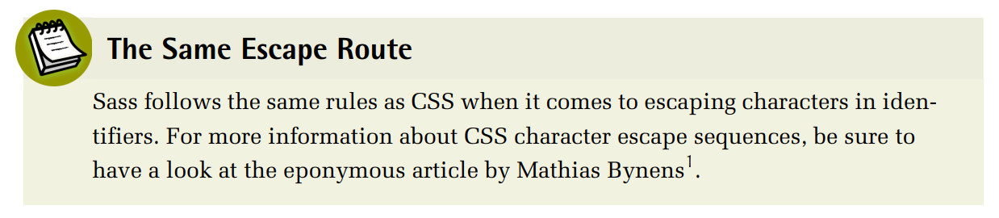
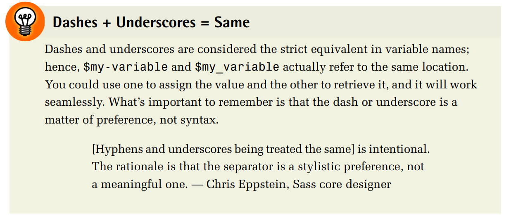

# **Variables**

***Variables are at the core of most—if not all—programming languages that ever existed. A `variable`, broadly speaking, is a storage location paired with an associated
identifier (aka a `variable name`). So a variable is basically made up of a key and a
value, the former being used to retrieve the latter.***

***When applied to Sass, variables give authors the ability to store bits of content so
that they can be reused throughout the stylesheets. This is especially handy for
colors: one can avoid having countless hues of the same color after a long time spent
working on a project. Variables can also be helpful for storing other types of content
such as font lists, maps of breakpoints, and default asset paths—presumably anything
that you may want to use multiple times across the stylesheet, particularly those
that could be updated at a later point.***


***A variable in Sass always starts with a dollar sign ($), whether you are using it for
assignment or retrieval. Directly next to the dollar sign comes the variable name,
which is usually made of latin characters, numbers and dashes, or underscores.
Actually, any character can be used as long as it is escaped if needed.***



***For assignment, the variable name and its value are separated with a colon. Finally,
a semicolon ends the statement (in the SCSS version only):***

```sass

// Variable assignment
$my-variable: 42px;

// Variable usage
.foo {
width: $my-variable;
}
```



## **Data Types**
***All values in Sass, or rather SassScript (the scripting language itself), are associated
to a specific data type. There are seven data types in SassScript:***

1. **string (e.g. "Hello world", kittens)**
1. **number (e.g. 42, 1337px)**
1. **color (e.g. hotpink, rgb(1, 33, 7), #BADA55)**
2. **Jump Start Sass■ list (e.g. (a, b, c), a b c)**
3. **map (e.g. (a: 1, b: 2))**
4. **bool (true or false)**
5. 

***Data types are a way for both Sass and those authoring content to know what kind
of operations and functions can be run on a specific value. As far as I can tell, all
programming languages use some form of typing.***

***For instance, we can perform mathematical operations with numbers and colors
(yes, colors!), but not strings. It is possible to run some specific functions on lists
and maps, but not on booleans and null values.***

***To know the type of a Sass variable, we use the type-of(..) built-in function. It
returns precisely one of the seven aforementioned types.***


## **Strings**
***The string data type has to be the most basic type there is since we use it in our
life so much, even outside of any computer-related activity. A string is nothing more
than a series of characters, such as Hello world!:***
```scss
$my-variable: "Hellow world;";
```
***In most languages, a string needs to be quoted, meaning it should be wrapped with
quotes, either double (") or simple ('). In Sass, however, strings do not have to be
quoted. It is perfectly fine for a string to live by itself without being wrapped within
quotes, as long as non-indentifier characters (latin alphabet, numbers, hyphens,
underscores, and spaces) are escaped. Moreover, an unquoted string is—thankfully—strictly equivalent to its quoted counterpart, so that "abc" (or 'abc') is the
same as abc. Quoting strings is usually considered best practice, however; not only
because it sticks to the syntax of most languages, but because there are some classic
gotchas with unquoted strings in Sass when they map with a CSS color keyword
(such as red).
String variables are useful for storing some CSS values, property names, or identifiers,
such as sans-serif, left, or margin-bottom. When storing string content that maps
Variables 17one-to-one with CSS (such as the three aforementioned examples), we usually omit
the quotes because CSS requires them unquoted:***

```scss
$font-name: "Helvatica";
$font-type: sans-serif;

.foo {
  font-family: $font-name, $font-type;
}


```

***Note that it is still possible to quote or unquote a string using the quote(..) and
unquote(..) native functions. For more information about how functions work,
refer to Chapter 4.***

***Strings can be concatenated (joined together) using the plus symbol (+). You can
thus create a new string from several chunks:***


```scss
$base-path: "/images/";
$file-name: "kittens";
$extension: "png";
$file-path: $base-path + $file-name + "." + $extension;

```

```scss

'/images/kittens.png'

```

## **Numbers**
***As with strings, numbers are a very basic type of content. I would not dare explain
to you what a number is, although I’ll point out a very important specificity about
Sass numbers before going any further: a number in Sass can—but does not necessarily—have a unit, like 42px.
This behavior, while unconventional at first glance, actually makes sense: you need
to be able to perform operations on numbers with a unit just as you run calculations
on numbers without. In other words, both 42 and 42px are numbers, while 42 px
and px42 are strings.
Returning to CSS, numbers are typically the sort of items you want to store in variables because they’re likely to be the moving parts of your application. Think of the
maximum width of the container (for example, 1180px), or the number of columns
in the grid system in use (such as 12). You want to make those values easily configurable in order to keep the codebase clean and maintainable:***

```scss

$container-max-width: 1180px;
.container {
  width: 100%;
  margin: 0 auto;
  max-width: $container-max-width;
}

```
***Obviously, you can perform operations on numerical values. Sass supports the five
basic operators: plus (+), minus (-), multiply (*), divide (/), and modulo (%). Some
Sass third-party tools such as Compass2 or SassyMath3 add extra math features; for
example, power (pow(..)), square root (sqrt(..)), Pi (pi()), and so on.
In the following example, we used the $element-width variable as the value for the
width property, as well as a way to compute the negative left margin required to
horizontally center the element:***


```scss
$element-width: 400px;
/**
* 1. Size the element
* 2. Horizontally center the element in its container
* @TODO: move to CSS transforms once we drop support for IE 8
*/

.foo {
  width: $element-width; /* 1 */
  position: absolute; /* 2 */
  left: 50%; /* 2 */
  margin-left: ($element-width / -2); /* 2 */
}


```
***Before going any further, you might be interested to know that division in Sass is
a bit more complex than first expected: the slash symbol (/) actually has a meaning
in CSS (think of the font shorthand property) . As a result, there are three scenarios
in which Sass does perform division instead of leaving the / as authored:***

1. **If the value, or any part of it, is stored in a variable or returned by a function.**
2. **If the value is surrounded by parentheses.**
3. **If the value is used as part of another arithmetic expression.**
## ****
******
```scss
.foo {
$gap: 20px;

// No variable nor parentheses: no division performed
font: 16px / 2 sans-serif;

// Wrapping parentheses: division returning 8px
padding: (16px / 2);

// Member as variable: division returning 10px
margin: $gap / 2;

// Arithmetic expression: calculation returning 308px
width: 300px + 16px / 2;
}
```
```scss
```

## ****
******
```scss

```
```sass
```

## ****
******
```scss

```
```scss
```

## ****
******
```scss

```
```scss
```

## ****
******
```scss

```
```scss
```

## ****
******
```scss

```
```scss
```

## ****
******
```scss

```
```scss
```

## ****
******
```scss

```
```sass
```

## ****
******
```sass

```
```sass
```

## ****
******
```sass

```
```sass
```